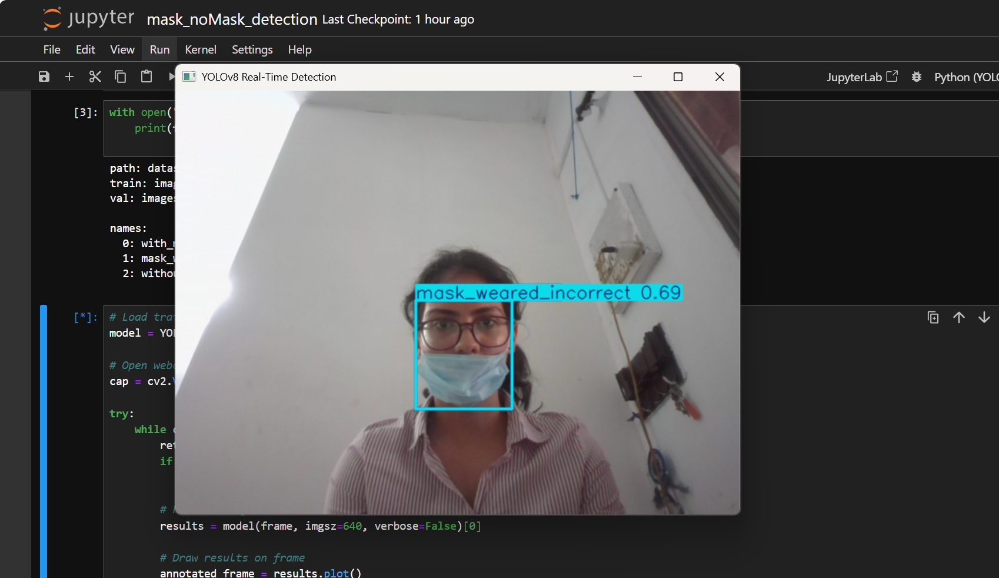
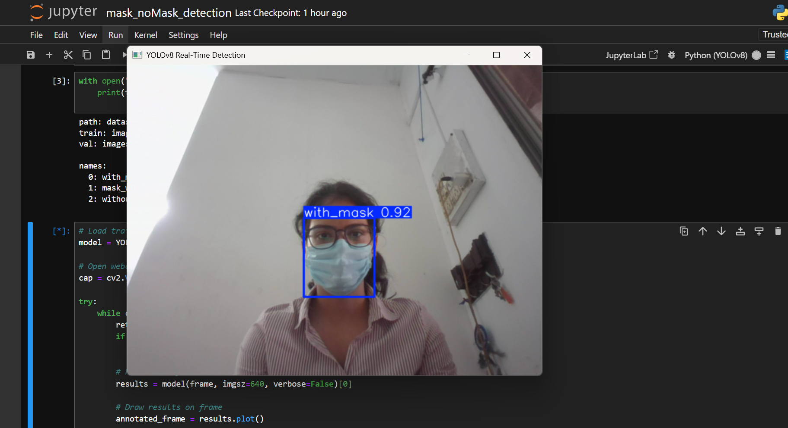
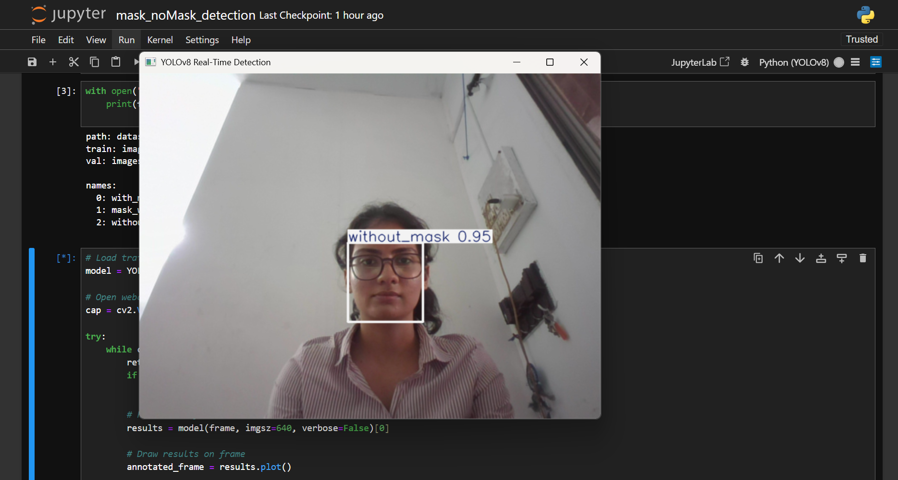

# Mask vs. No Mask Face Detection

This project implements a deep learning-based face mask detection system that identifies whether a person is wearing a mask or not in images or videos. Leveraging computer vision and convolutional neural networks, it provides an effective solution for safety monitoring, particularly for public health compliance.

## Features

- Detects faces in images or video frames
- Classifies detected faces as **with_mask**, **without_mask** and **mask_weared_incorrect**
- Visualizes results with bounding boxes and labels right on the images
- Easy to train and test using your own custom datasets
- Modular, extensible codebase

## Technologies Used

- Python 3.10
- TensorFlow and Keras 
- OpenCV 
- NumPy and Matplotlib 
- Jupyter Notebook

  ## Sample Results

Here are some predictions from the trained model:





## Installation

Follow these steps to set up the project locally:

1. **Clone the repository**:
    ```
    git clone "https://github.com/Buckyvs/Mask-No-Mask-Detection.git"
    ```

2. **Install dependency**:
    ```
    pip install tensorflow keras opencv-python numpy matplotlib jupyter
    ```

**Make sure you have Python 3.10 installed on your system.**

## Usage

1. **Open the Jupyter notebook**:

    ```
    jupyter notebook mask_noMask_detection.ipynb
    ```

2. **Run the notebook cells** sequentially to:
    - Load data
    - Train the model
    - Test detection on sample images or video

3. **Test with your own data** by updating the corresponding paths inside the notebook.


